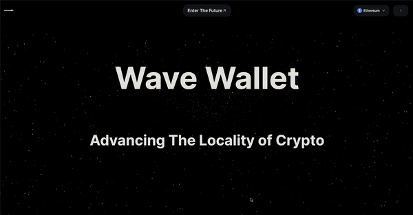
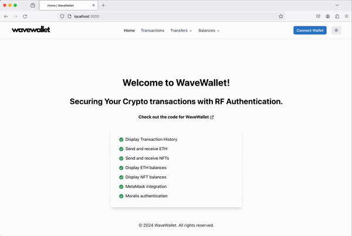

This project demonstrates how to integrate an Arduino RF handshake process with a Next.js application to approve Ethereum transactions before sending them through Metamask. The handshake is performed between two Arduino devices communicating via RF waves, utilizing frequency hopping to increase security and prevent unauthorized interception of the communication.

# Table of contents

  - [Overview](#Overview)
  - [How it Works](##How-it-Works)
  - [Dependencies](##Dependencies)
  - [License](##License)

## Overview

The project consists of three main components:

1. A Next.js frontend application that allows users to enter a recipient address and an amount of ETH to send. When the user clicks the "Send" button, the application communicates with an API route to check if the transaction is approved by the Arduino devices.

2. A Python script that communicates with the sender Arduino device over a serial connection to initiate the RF handshake process and receive the approval status.

3. Two Arduino devices (sender and receiver) equipped with RF modules that communicate with each other using frequency hopping to approve or reject the transaction based on certain conditions.

## How it Works

1. The user enters the recipient address and the amount of ETH to send in the Next.js frontend application.

2. When the user clicks the "Send" button, the `startPayment` function in `ETHTransfers.tsx` is triggered.

3. The `startPayment` function makes a POST request to the `/arduino-handshake` API route, passing the recipient address and amount as request body.

4. The API route (`/arduino-handshake.js`) receives the request and spawns a child process to run the `arduino_handshake.py` Python script, passing the necessary arguments (action, recipient, and amount).

5. The `arduino_handshake.py` script communicates with the sender Arduino device over a serial connection, sending the transaction details (recipient and amount) to the sender Arduino.

6. The sender Arduino device initiates the RF handshake process by sending the transaction details to the receiver Arduino device via RF waves, using frequency hopping to change the communication channel at predefined intervals.

7. The receiver Arduino device, also employing frequency hopping, receives the transaction details and determines whether to approve or reject the transaction based on its internal logic (not provided in this example).

8. The receiver Arduino sends the approval status back to the sender Arduino via RF waves, using frequency hopping to maintain secure communication.

9. The sender Arduino receives the approval status and sends it back to the Python script over the serial connection.

10. The Python script prints the approval status (`True` or `False`) to the console, which is captured by the API route.

11. The API route sends a response back to the Next.js frontend application, indicating whether the transaction is approved or not.

12. If the transaction is approved, the Next.js application proceeds to send the transaction through Metamask using the `ethers.js` library.

13. If the transaction is not approved, an error is thrown, and the transaction is not sent. An error toast notification is displayed to the user.

## Dependencies

- Next.js
- React
- Chakra UI
- Moralis API
- MetaMask APO
- ethers.js
- Python
- pyserial
- Arduino IDE
- RF modules (nRF24L01)

## License

WaveWallet is open-sourced software licensed under the MIT license.
